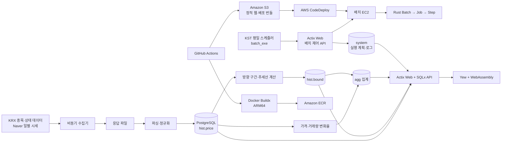

# Stockbot Engineering Case Study

[](https://github.com/cheolgyu/stockbot-engineering-case-study/actions/workflows/safety.yml)

[English](README.en.md) · [검증 근거](docs/validation.md) · [주장 범위](docs/claims-boundary.md)

비공개 시장 데이터 프로젝트의 설계와 시행착오를 공개 가능한 문서, 합성 데이터, 독립 실행 예제로 재구성한 기술 사례집입니다. 원본 저장소의 소스·Git 이력·운영 데이터를 복제한 저장소는 아닙니다.

> 이 공개 사례집의 문서·합성 SQL·독립 Rust 예제·검증 자동화는 2026-10에 사용자가 공개 범위를 결정하고 AI 에이전트와 함께 재구성했습니다. 2022~2025년 원본 코드나 당시의 단독 저작 증거로 동일시하지 않습니다.

## 프로젝트 목적

Stockbot은 국내 주식의 종목 정보와 일별 OHLCV를 수집하고, 가격 방향 구간·변동률·거래량·종가·기간별 수익률을 계산해 웹에서 탐색하는 개인용 시장 데이터 리서치 시스템입니다.

실제 매수·매도 주문을 실행하는 자동매매 시스템은 아닙니다. 투자 수익률이나 예측 정확도보다 다음 엔지니어링 문제를 다뤘습니다.

- 수십 년치 시계열 데이터를 반복 수집할 때 중복을 피하는 증분 적재
- 약 3,500만 행 규모의 가격·분석 이력을 처리하는 배치 구조
- 장시간 실행 작업의 `Batch → Job → Step` 분해와 실행 이력 관리
- 수집, 분석, API, 웹, 배포 책임의 분리
- ARM64 환경을 포함한 컨테이너 빌드와 AWS 배포 자동화

주 사용자는 개발자 본인이었습니다. 불특정 다수를 대상으로 운영한 상용 서비스나 공개 투자 서비스로 설명하지 않습니다.

## 환경과 시스템 구성

아래 구조는 2022~2025년 주 Rust 구현을 기준으로 합니다. 2026년 React·Axum·TimescaleDB 현대화 상태와는 구분합니다.



### 기술 환경

| 계층 | 2022~2025년 주 구현 |
| --- | --- |
| 언어·런타임 | Rust 2021, Tokio |
| 데이터 접근 | SQLx, PostgreSQL |
| API | Actix Web, REST, OpenAPI/Swagger |
| 웹 | Yew 0.21, Trunk, WebAssembly, `wasm-bindgen`, `gloo`, `yew-router` |
| 배치 | 자체 `Batch → Job → Step` 실행 모델 |
| 비동기 처리 | Tokio task, bounded async channel |
| 빌드·배포 | Docker, Docker Buildx, ARM64 Ubuntu, GitHub Actions |
| AWS | EC2, ECR, S3, CodeDeploy |
| 실행 이력 | PostgreSQL에 배치 계획과 Job·Step 시작·종료 시각 기록 |

### 모듈 토폴로지

2025년 말 Rust workspace는 역할이 다른 9개 crate로 구성됐습니다.

| 모듈 | 책임 |
| --- | --- |
| `batch` | 데이터 수집, 파싱, 분석, 집계 Job 실행 |
| `batch_model` | DB·API·웹이 공유하는 도메인 모델과 enum |
| `batch_exe` | 한국 시간 기준 평일 배치 실행 스케줄러 |
| `batch_client` | 스케줄러와 배치가 제어 API를 호출하는 HTTP 클라이언트 |
| `site-api` | 가격·분석·집계·시스템 로그 REST API |
| `site` | Yew/WASM 웹 클라이언트 |
| `utils` | DB 연결, 환경 설정, 로그와 공통 유틸리티 |
| `tb_row` | 테이블 응답을 위한 공통 trait |
| `tb_row_derive` | 필드 순서와 직렬화를 생성하는 proc macro |

`Batch`, `Job`, `Step`이라는 용어와 reader-process-writer 구분은 Spring Batch에서 착안했습니다. Spring Batch 자체를 Rust로 완전히 재구현했다는 주장은 하지 않습니다. 자세한 책임 분리는 [역사적 시스템 아키텍처](docs/architecture.md), 실행 계약과 결함은 [배치 실행 모델](docs/batch-runtime.md)에 기록했습니다.

## 주요 기능

### 데이터 수집

- 국내 종목 코드, 표준 코드, 거래소, 상장일, 종목 유형 수집
- 거래정지, 관리종목, 투자주의·경고·위험 등 종목 상태 관리
- 종목별 DB 최종 일자를 조회해 이후 구간만 요청하는 증분 수집
- 일별 시가·고가·저가·종가·거래량 파싱
- 가격을 부동소수점 대신 `Decimal`로 변환
- `(code_id, dt)` 키를 기준으로 멱등 upsert
- 2025-11 가격 데이터 소스를 KRX 방식에서 Naver 차트 API 방식으로 전환

### 분석과 집계

- 전일 대비 거래량 변화율
- 당일 저가-고가 및 시가-종가 변화율
- 시가·고가·저가·종가 네 가격선을 각각 분석
- 상승·하락·보합 방향이 바뀌는 지점을 구간으로 분리
- 각 구간의 시작점·종료점, 기간, 가격 차이, 변화율 계산
- 두 점을 지나는 기울기·절편과 다음 지점의 선형 값 저장
- 종가, 거래량, 방향 구간의 기간별 집계
- 날짜 기준 수익률과 조건 기반 종목 탐색
- 배치 실행 계획, Job·Step 로그, health-check 조회

방향 구간 계산의 핵심 루프는 가격 배열을 한 번 순회하면서 같은 방향을 이어 붙입니다. 그러나 전체 배치 비용에는 종목별 DB 조회와 저장 방식도 포함되므로, 전체 파이프라인을 단순히 `O(n)`이라고 주장하지 않습니다.

### 웹과 API

역사적 Yew/WASM 클라이언트와 Actix API에는 다음 기능이 있었습니다.

- 종목 검색과 상세 가격 조회
- 가격 변화율과 날짜별 수익률
- 종가·거래량·방향 구간 집계
- 방향 구간 목록과 종목 상세
- 조건 기반 종목 탐색 화면
- 배치 실행 로그
- Swagger/OpenAPI 문서

2026년에는 웹을 React로 전환했습니다. 따라서 이 문서의 Yew/WASM 설명은 역사적 구현이며 현재 개발 브랜치 UI와 같은 시점의 상태가 아닙니다.

## 데이터 흐름

1. `batch_exe`가 서울 시간과 평일 여부를 확인합니다.
2. 실행 시각이 되면 `batch_client`가 API의 배치 시작 endpoint를 호출합니다.
3. API는 `system` schema에 실행 계획을 저장하고 배치용 EC2 시작을 요청합니다.
4. 배치는 PostgreSQL에서 각 종목의 `MAX(dt)`를 조회해 수집 시작일을 정합니다.
5. 외부 시세 응답을 파일로 저장하고 bounded channel로 파싱·저장 작업에 전달합니다.
6. 파서는 날짜와 OHLCV를 정규화해 종목 단위 transaction으로 `hist.price`에 upsert합니다.
7. PostgreSQL procedure가 window function `LAG`를 사용해 전일 대비 변화율을 계산합니다.
8. 배치가 각 종목의 네 가격선을 읽어 방향 전환 구간과 추세선 정보를 생성합니다.
9. 종가·거래량·구간·기간 수익률 집계를 갱신합니다.
10. Actix Web API가 가격, 분석 결과, 집계와 실행 로그를 Yew/WASM 클라이언트에 제공합니다.
11. 배치 종료 시 API에 완료 요청을 보내 실행 계획을 닫고 배치 인스턴스 종료를 요청합니다.

현재 Naver 수집기의 다운로드 요청 자체는 종목별로 순차 `await`합니다. bounded channel은 주로 파일 파싱과 DB 저장을 병렬화하므로 “모든 종목을 완전 병렬로 수집했다”고 표현하지 않습니다.

## DB 구조와 데이터 규모

주요 PostgreSQL schema는 다음과 같이 책임을 나눴습니다.

| schema | 데이터 |
| --- | --- |
| `public` | 종목, 종목 상세, 거래 상태 |
| `hist` | 일별 가격, 가격 변화율, 방향 구간 |
| `agg` | 종가·거래량·구간·기간별 집계 |
| `system` | 배치 계획, Job·Step 실행 로그, health-check |

원래 `hist.price`와 `hist.bound`는 날짜 기준 연도별 PostgreSQL RANGE partition을 사용했습니다. 비공개 백업 기록상 2025-09-25 스냅샷에는 다음 데이터가 있었습니다.

| 테이블 | 기록된 행 수 |
| --- | ---: |
| 가격 이력 | 11,045,205 |
| 방향 구간 이력 | 23,923,126 |
| 합계 | 34,968,331 |

이 값은 현재 운영량·요청 처리량·사용자 수가 아니라 당시 로컬 DB의 저장 데이터 규모입니다. 원시 데이터와 DB dump는 공개하지 않습니다.

## AWS CI/CD

역사적 GitHub Actions workflow는 산출물별로 다르게 동작했습니다.

| 산출물 | 파이프라인 |
| --- | --- |
| Yew/WASM 웹 | Docker Buildx 빌드 → 컨테이너에서 정적 `dist` 추출 → S3 정적 파일 갱신 |
| Actix API | ARM64 이미지 빌드·ECR push → 실행 스크립트와 설정 bundle을 S3에 저장 → CodeDeploy로 EC2 배포 |
| 배치 스케줄러 | ARM64 이미지 빌드·ECR push → S3 bundle → CodeDeploy |
| 본 배치 이미지 | ARM64 이미지 빌드·ECR push |

비공개 원본의 Actions 기록에서 2025년 웹, API, 배치, 스케줄러 workflow의 성공 실행을 확인했습니다. 그러나 본 배치 workflow에는 실제 CodeDeploy 단계가 없으므로 네 구성요소 모두가 같은 방식으로 자동 배포됐다고 쓰지 않습니다.

또한 원본 workflow는 빌드·배포 중심입니다. 명시적인 lint, 단위 테스트, 통합 테스트, 보안 스캔을 모두 통과시켜야 배포되는 완전한 품질 gate였다고 주장하지 않습니다. 비공개 원본의 역사적 배포 설정에는 현재 기준으로 공개하면 안 되는 민감 정보 처리 방식도 있어, 이 사례집에는 값·식별자·원본 설정 파일을 포함하지 않았습니다.

## 주요 병목과 해결 과정

### 1. 수천만 건의 방향 구간 적재

수천만 건의 방향 구간을 하나의 동적 `VALUES` 쿼리로 만들면 쿼리 크기와 bind 처리에서 오류가 발생했습니다. 데이터 양과 실행 목적에 따라 세 경로를 검토·구현했습니다.

- 소규모 증분 처리: 충돌 키 기반 row upsert
- 중간 규모 묶음 처리: PostgreSQL 배열과 `UNNEST`
- 전체 이력 backfill: CSV 생성 후 PostgreSQL `COPY`

2025년 기록에는 전체 구간 CSV가 약 1.8GB였고 약 2,392만 행을 적재·검증한 흔적이 남아 있습니다. 별도 전체 이력 계산 경로에는 1995~2025 구간 실행이 23분 25초 걸렸다는 측정도 있습니다.

세 방식이 모두 운영 기본 경로였다는 뜻은 아닙니다. 기본 배치에는 여전히 row 단위 upsert가 남아 있고, `UNNEST`와 `COPY`는 대량 backfill을 위해 실험·구현한 경로입니다. 기록된 6초·2.3초 수치는 `COUNT(*)` 실행 시간이라서 `COPY` 적재 시간으로 해석하지 않습니다.

### 2. 비동기 처리와 DB connection pool

초기 구현에서는 작업 수를 늘리는 과정에서 pool timeout이 발생했습니다. connection 수를 5에서 지나치게 큰 값으로 올렸다가 다시 50으로 낮췄고, 무제한 task 생성 대신 bounded channel과 제한된 worker를 사용했습니다.

이 과정에서 얻은 설계 원칙은 다음과 같습니다.

- 네트워크 요청 수와 DB connection 수를 같은 기준으로 늘릴 수 없음
- channel capacity로 메모리와 대기 작업 수를 제한해야 함
- worker 수와 pool 크기를 함께 조정해야 함
- 다운로드, 파싱, DB 저장 병목을 분리해서 측정해야 함

이는 처음부터 완성된 동시성 설계의 증거가 아니라, 실패와 과도한 설정을 실제로 수정한 과정입니다.

### 3. ARM64 컨테이너 배포

초기 ARM 배포에서는 architecture 불일치에 따른 `exec format error`, Alpine/glibc 호환성, OpenSSL cross-compile 문제가 발생했습니다. 최종적으로 다음 구성으로 정리했습니다.

- GitHub Actions의 QEMU와 Docker Buildx
- `aarch64-unknown-linux-gnu` target
- ARM64 Ubuntu runtime image
- 필요한 구간의 vendored OpenSSL
- ECR 이미지 저장
- S3 기반 Docker/sccache 실험

### 4. 가격 데이터 소스 변경

기존 KRX 가격 수집 경로의 유지 비용 때문에 2025-11 Naver 시세 endpoint 기반 수집기로 전환했습니다. DB의 종목별 최종 일자를 기준으로 증분 범위를 계산하는 구조는 유지하고 downloader와 parser를 교체했습니다.

### 5. 배치 실패 수명주기

원본 `Batch → Job → Step` 구조는 성공 경로에서는 시작·종료 기록을 남겼지만, 중간 오류가 반환되면 일부 종료 처리와 실패 상태 기록을 건너뛸 수 있었습니다. `unwrap`과 `expect`도 남아 있었습니다.

이 사례집은 원본을 완성된 프레임워크처럼 복사하지 않았습니다. 대신 실패한 Step·Job·Batch가 모두 종결되고 이후 작업을 실행하지 않는 계약을 [독립 Rust 예제](examples/resilient-batch/)와 [수명주기 테스트](examples/resilient-batch/tests/lifecycle.rs)로 다시 검증했습니다.

### 6. ISO 주차 연도 경계

주간 집계에서 달력 연도와 ISO 주차 번호를 섞으면 2021년 1월 1일 같은 날짜가 잘못 분류될 수 있습니다. 공개 [주간 집계 SQL](sql/weekly-aggregation.sql)은 다음 원칙을 적용합니다.

- `date_trunc('week', observed_on)`을 주 식별자의 기준으로 사용
- `EXTRACT(ISOYEAR ...)`와 `EXTRACT(WEEK ...)`를 함께 저장
- transaction-scoped advisory lock으로 중복 실행 직렬화
- upsert로 같은 원천 데이터에 대해 멱등 갱신
- 연도 경계 합성 회귀 테스트

## Go·Spring·Rust 구현 계보

서로 다른 구현을 하나의 완성 제품처럼 합치지 않고, 확인된 기간과 역할을 분리했습니다.

| 기간 | 구현 | 확인된 범위 | 해석 |
| --- | --- | --- | --- |
| 2021-06-29 ~ 2022-03-11 | 초기 인프라·컨테이너 실험 | 공개 저장소 17개 커밋 | 제품 이전 단계의 환경 실험 |
| 2022-05-25 ~ 2022-08-02 | Go 프로토타입 | 공개 저장소 78개 커밋 | Rust 구현과 잠시 병행한 초기 버전 |
| 2022-07-29 ~ 2025-12-02 | 주 Rust 구현 | 비공개 Git 이력 1,388개 커밋 | 수집·분석·API·Yew/WASM·AWS 배포로 확장된 주 구현 |
| 2023-11-20 ~ 2024-04-10 | Spring Batch 실험 | 비공개 저장소 21개 커밋 | Rust 개발 도중 별도로 진행한 종목 메타데이터 수집 프로토타입 |
| 2026-04-18 ~ 2026-05-05 | 현대화 브랜치 | 비공개 Git 이력 54개 커밋 | AI 에이전트 보조 작업을 포함해 원 개발 구간과 분리 |

Spring 구현에는 KRX 요청, 파일 다운로드, Excel→CSV 변환, chunk reader/processor/writer, JDBC upsert로 이어지는 종목 메타데이터 수집 흐름이 있습니다. 그러나 가격·분석·API·웹까지 Rust 시스템과 동등하게 완성한 버전은 아닙니다.

따라서 전체 이력을 단순한 `Go → Spring → Rust` 순차 마이그레이션으로 표현하지 않습니다. 상세 기간과 산정법은 [프로젝트 계보](docs/lineage.md)에 있습니다.

### 외부에서 확인 가능한 기여

- Actix 공식 examples 저장소에 multipart·object-storage 예제 [PR #250](https://github.com/actix/examples/pull/250)과 후속 async 수정 [PR #252](https://github.com/actix/examples/pull/252)가 병합됐습니다. 첫 PR은 9개 파일, 357 additions입니다.
- Rust crate [`tb_row` 1.0.0](https://crates.io/crates/tb_row)을 배포했습니다. 2026-10-06 확인 기준 누적 다운로드는 1,544회이며, 이를 고유 사용자 수로 해석하지 않습니다.
- 세부 근거와 공개 범위는 [오픈소스 근거](docs/open-source.md)에 정리했습니다.

Rust를 선택한 동기는 장시간 실행되는 배치의 런타임·메모리 사용을 더 세밀하게 통제하고, 배치·API·당시 WASM 클라이언트에서 타입을 공유하려는 것이었습니다. 동일 데이터와 장비에서 Go·Spring·Rust를 비교한 벤치마크가 없으므로 “Rust로 몇 배 빨라졌다”는 주장은 하지 않습니다.

## 2026년 AI 보조 현대화

2026년 변경은 2022~2025년 직접 개발 구간과 분리합니다. 개발 브랜치의 54개 커밋 중 50개에는 Claude 공동 작성 표기가 있습니다.

확인된 변화는 다음과 같습니다.

- Actix Web에서 Axum으로 API 이전
- Yew/WASM에서 React 19, Vite, TypeScript로 프런트 전환
- Rust 모델에서 TypeScript 타입을 생성하는 `ts-rs` 적용
- PostgreSQL native partition을 TimescaleDB hypertable로 전환
- React route별 code splitting
- batch의 panic·unwrap 정리와 binary/library 중복 컴파일 제거
- 계절성, 랠리 패턴, factor observation 기능 실험

### 저장 공간 최적화 결과

| 대상 | 이전 | 이후 |
| --- | ---: | ---: |
| `hist.bound` | 2,371MB | 864MB |
| `hist.price` | 약 2GB | 383MB |
| 전체 DB | 9,874MB | 3,475MB |

약 2,393만 행의 `hist.bound`를 보존한 채 hypertable과 30일 압축 정책을 적용했습니다. `hist.price` migration 중에는 106개 partition을 제거하는 과정에서 `max_locks_per_transaction=64`를 초과했습니다. 한도를 512로 조정하고 이미 복사된 staging table을 재사용하는 복구 SQL로 migration을 마쳤습니다.

React 프런트의 route code splitting 기록에서는 공통 JS가 501KB에서 267KB로 줄고, 161KB 차트 chunk를 종목 상세 진입 시점까지 지연했습니다. 이 수치들은 비공개 개발 브랜치의 build 기록이며 공개 서비스의 사용자 체감 성능 자료는 아닙니다.

가장 중요한 미완료 사항도 있습니다. 압축된 과거 TimescaleDB chunk에는 기존 full-history upsert 배치를 그대로 실행할 수 없습니다. 신규 데이터만 계산하는 증분 배치로 바꾸거나 실행 전후 decompress/recompress 정책을 적용해야 하며, 현대화 상태에서 전체 배치 재가동은 아직 증명되지 않았습니다.

따라서 저장 공간 절감 결과를 “현재 운영 배치까지 완성됐다”는 근거로 사용하지 않습니다.

## 현재 한계와 주장하지 않는 것

- 현재 운영 중인 공개 서비스, 사용자 수, 트래픽 또는 매출을 증명하지 않습니다.
- 투자 수익률, 예측 정확도 또는 자동매매 성과를 증명하지 않습니다.
- 실시간 스트리밍 시스템이 아니라 일별 배치 중심입니다.
- Naver 다운로드 요청은 현재 종목별 순차 실행입니다.
- 일부 가격·구간 저장 경로에는 row 단위 upsert가 남아 있습니다.
- 원본에는 동적 SQL, `unwrap`·`expect`, 수동 SQL migration이 남아 있습니다.
- migration이 Flyway나 `sqlx migrate` 같은 단일 도구로 완전히 관리되지 않았습니다.
- 2026년 TimescaleDB 전환 이후 기존 full-history 배치 호환성이 해결되지 않았습니다.
- Oracle Cloud 배포 문서와 스크립트는 설계·준비 상태이며 실제 배포 완료가 아닙니다.
- Go·Spring·Rust 구현의 동일 조건 성능 비교 자료가 없습니다.
- 비공개 원본 전체의 무결점이나 프로덕션 준비 상태를 증명하지 않습니다.
- 2026년 AI 보조 변경을 과거 본인 단독 개발로 소급하지 않습니다.
- 원본에는 공개할 수 없는 역사적 설정과 운영 자료가 있어 저장소 전체를 공개하지 않습니다.

면접·이력서에서 사용할 수 있는 문장과 피해야 할 표현은 [주장 범위](docs/claims-boundary.md)에 분리했습니다.

## 검증

이 공개 사례집은 작은 예제를 큰 원본 시스템처럼 보이게 하지 않습니다. 외부에서 다시 실행할 수 있는 범위만 합성 데이터와 독립 예제로 제공합니다.

- 실패 경로까지 종료 상태를 남기는 Rust 배치 수명주기 예제
- ISO 주차 연도 경계를 검증하는 PostgreSQL 집계 SQL
- 공개 문서의 개인정보·민감정보 검사
- Markdown 내부 링크 검사

Windows PowerShell에서 전체 검증을 실행하려면 PostgreSQL SQL 검증용 Docker가 필요합니다.

```powershell
./scripts/verify.ps1
```

개별 명령과 확인 결과는 [검증 근거](docs/validation.md)에 기록합니다. GitHub Actions도 같은 개인정보·Rust·PostgreSQL 검사를 수행합니다.

## 공개 원칙

원본에는 공개할 수 없는 설정과 운영 자료가 있어 fresh Git 이력으로 다시 작성했습니다. 원본 코드, 환경 파일, 로그, DB dump, 시장 원자료, 클라우드 식별자는 포함하지 않습니다. 자세한 기준은 [PRIVACY.md](PRIVACY.md)와 [SECURITY.md](SECURITY.md)를 참고하세요.

## 문서 지도

- [프로젝트 계보와 기여 구간](docs/lineage.md)
- [역사적 시스템 아키텍처](docs/architecture.md)
- [배치 실행 모델과 실패 처리](docs/batch-runtime.md)
- [WASM 및 오픈소스 근거](docs/open-source.md)
- [재현 가능한 검증 결과](docs/validation.md)
- [이력서·면접 주장 범위](docs/claims-boundary.md)

## License

새로 작성한 문서와 예제 코드는 [MIT License](LICENSE)로 공개합니다. 비공개 원본 코드에 대한 라이선스나 접근 권한을 부여하지 않습니다.
